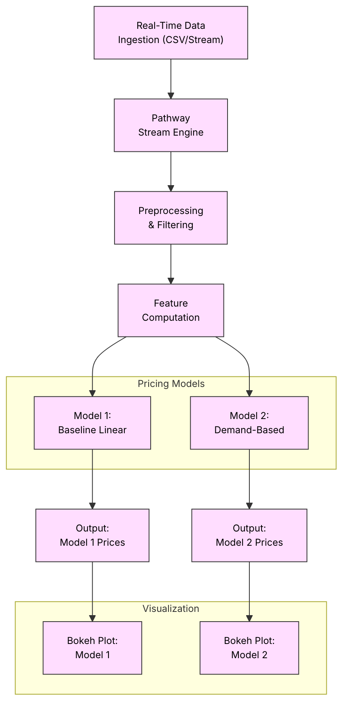

# 🚗 SmartParkr – Real-Time Dynamic Parking Pricing

SmartParkr is a real-time dynamic parking pricing system that uses **Pathway** for real-time data streaming and transformation, and **Bokeh** for live visualization. This project simulates live parking sensor data, calculates dynamic prices based on occupancy and demand, and visualizes trends over time.

## 📌 Project Overview

Urban parking demands fluctuate based on traffic, vehicle type, and time of day. SmartParkr simulates this environment using real-time data replay to:
- Predict parking prices using **Model 1 (Occupancy-Based)** and **Model 2 (Demand-Based)**
- React to various features like traffic congestion, queue length, special events, and vehicle type
- Visualize parking trends in real time with interactive dashboards

> This project aligns with Smart Mobility and Urban Infrastructure Optimization use cases.

---

## 🛠 Tech Stack

| Layer                | Tools Used                                      |
|----------------------|-------------------------------------------------|
| 💡 Core Framework    | [Pathway](https://pathway.com/)                |
| 📊 Visualization     | [Bokeh](https://bokeh.org/) + [Panel](https://panel.holoviz.org/) |
| 📈 Data Processing   | `Pandas`, `NumPy`                               |
| 🧪 Environment       | Google Colab (GPU-accelerated, notebook-based) |
| 📄 Dataset Source    | Custom CSV with real-world parking features     |

---

## ⚙️ Project Architecture

### 🏗 System Flow:

1. **Data Preparation**:
   - Simulated or real CSV data contains features like `Occupancy`, `Capacity`, `VehicleType`, `TrafficCondition`, etc.
   - Time-stamped fields are merged into a single `Timestamp` column to preserve chronological order.

2. **Model 1 – Baseline Price**:
   - Formula: `Price = BASE_PRICE + α * (Occupancy / Capacity)`
   - Simple linear scaling based on how full a lot is.

3. **Model 2 – Demand-Aware Pricing**:
   - Factors: Occupancy ratio, queue length, traffic level, special day flag, vehicle weight
   - Formula:
     ```
     DemandRaw = α * OccupancyRatio + β * QueueLength - γ * TrafficLevel + δ * IsSpecialDay + ε * VehicleWeight
     Price = BASE_PRICE * (1 + λ * normalized_demand)
     ```

4. **Real-Time Streaming (Pathway)**:
   - Using `pw.demo.replay_csv()` to simulate streaming
   - Pathway schemas define column types and structure
   - Models are applied as user-defined functions (`@pw.udf`) to compute price in real time

5. **Bokeh Visualization**:
   
   - Line plots show `PriceModel1` vs `PriceModel2` over time
   - Real-time output is rendered via `pn.Column().servable()` using Pathway’s built-in plotting interface

---


## Architecture Diagram

